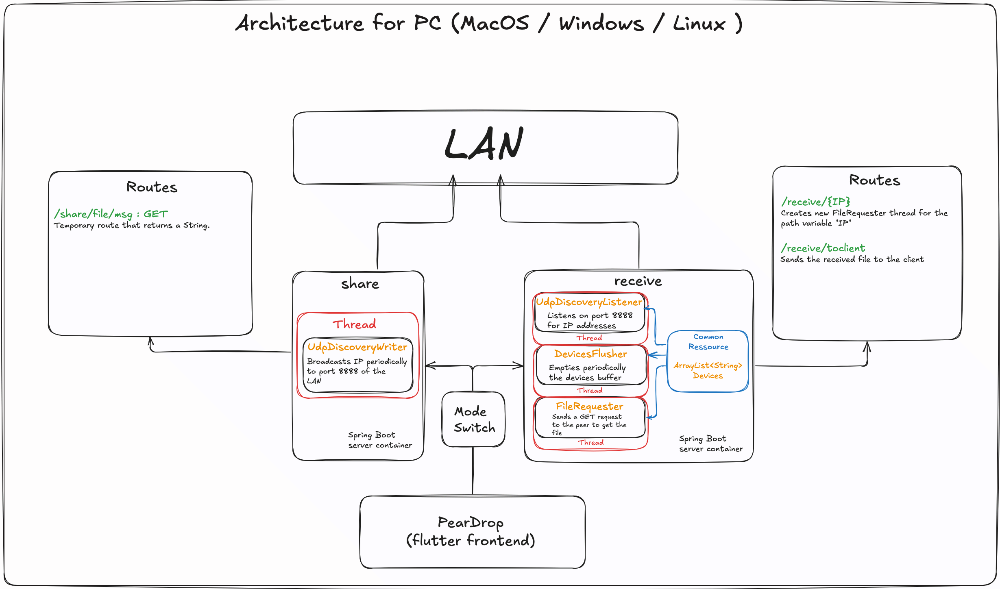

# PearDrop


<p align="center">
  "A nearby file-sharing app ."
</p>

<a href="https://github.com/AmineSidki/PearDrop/graphs/contributors">
  <p align="center">
  <br>
    AmineSidki
  </p>
</a>

>[!TIP]
>To start the server in :   
>- **Sharing Mode** : ```./mvnw spring-boot:run -Dspring-boot.run.arguments="--mode=s"```
>- **Receiving Mode** : ```./mvnw spring-boot:run -Dspring-boot.run.arguments="--mode=r"```

## Architecture For PC   

<br>
This is more or less the same thing I will implement for mobile , but given how I cannot start a Spring Boot server on android unless it is rooted (so much for freedom), I will have to writean HTTP server in dart to interact with the spring boot one.   

SO to resume : 

- The PC client will have a ```.jar``` file of the server as well as the application
- The android client (I ain't making an app for IOS that no one will be able to download anyway) will be just the apk . I just wanted to make an app in the summer , this is a whole wormhole man :( .   

**ReadME written in VIM btw**
