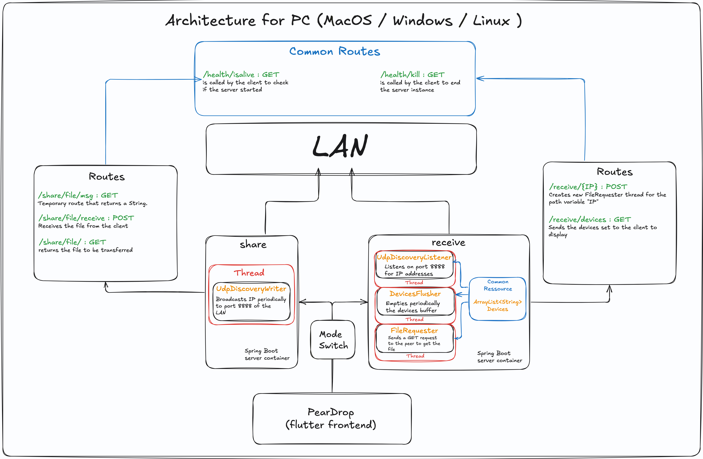

# PearDrop


<p align="center">
  "A nearby file-sharing app ."
</p>

>[!TIP]
> All you need to run the application is the Flutter SDK available here : https://docs.flutter.dev/get-started/install

## Architecture For PC   

<br>

### To explain this whole schema :  
A Spring-boot server is bundled with the flutter application as an asset , on startup , the frontend checks if the documents folder contains the server and if it doesn't then it 'pastes' on over there . Then , depending on which operation you will want to make (share / receive) the application will then start the server on the corresponding mode .  
  
 - **Sharing Mode** : The server makes a UDP socket broadcasting object to open the routes of necessary for sharing , once the client sends the files* , by sending them to the ```/share/file/receive``` route that , parses it into a FileDTO object and starts broadcasting on the 8888 port of the network the devices's IP address .  
 - **Receiving Mode** : The server makes a UDP socket listener to listen to all the devices that are present on the network , it runs on a thread alongside a device flusher thread that empties the devices list periodically . When the client sends a request to the ```/receive/<SharerIp>``` the backend makes a file requester object that handles the http request to the other device's backend and it transfers it to the receiver whom gets the file on the frontend . The latter creates a file in the Documents folder/directory and writes the file byte by byte .

(*) : The way files are transferred is inefficient as the are not really partitionned and so transferring a large file would actually load that entire file to the memory , thus , with a large enough file , crash the device . Not only that , but the way the sharing routes are accessible to anyone creates a huge security risk , anyone , with enough knowledge to use a HEX editor and postman can effectively change the file that anyone is sharing  to anything he wants . Then again that would be remediable by making the shared file final since you cannot change the file you are sharing without rebooting the server anyway .


## Issues :

  Another issue , is the fact that since the Spring server is started from the shell , it is not considered as a child process , thus , changing server modes , while shutting down the server , it shuts down "Gracefully" , initially for "optimal" ressource freeing , but ends up not ending the JREs processes.   
  
Also , on the theme of issues , I found that weirdly on windows , the receiving functionnality only works when the server is started externally , the application works perfectly on macOS when using dev mode , but once I build it , no more .  

## About the developement of peardrop

It is my first experience with flutter and dart and one of my first experiences with Spring boot , and while I do admit this project is quite ambitious but I admit , I made lots of mistakes like :
 - I should have taken time to see what works and what doesn't , instead of forcefully shoving Spring boot into flutter's throat , the better way of doing things would have been making a http server in dart , that would have definitely gave me a LOT more control over the interaction between the server and client and overall a much more stable application.
 - Initially I planned a cross platform application to run on both desktop and android , and the first issue I ran into was inevitably that android cannot run java applications natively without Termux or rooting , and android is sandboxed , making hosting a http server , even made with dart native , for lack of better words , a huge pain in the ass . Effectively , the server would not have been hosted on a different IP address from the device's making it not only confusing but also much much slower.

**ReadME written in VIM btw**
